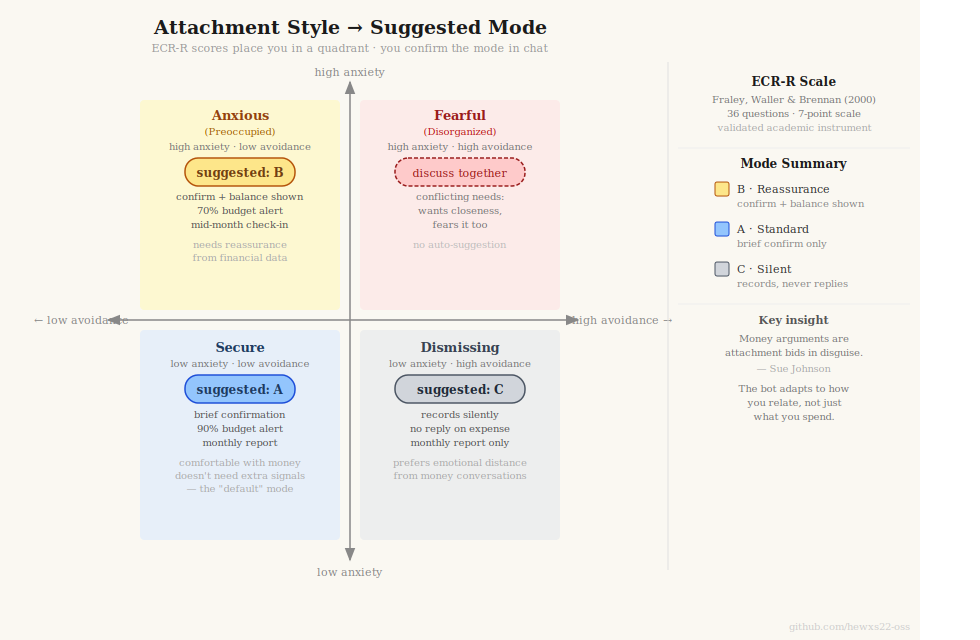
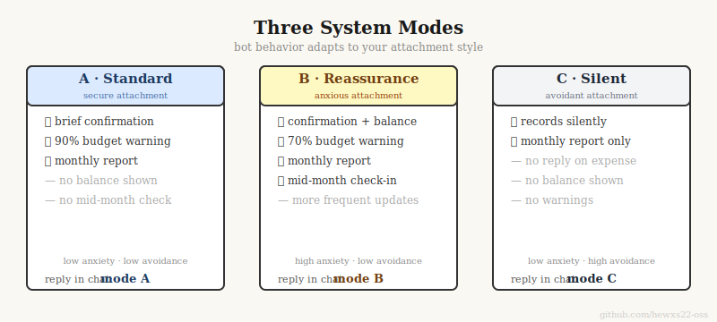
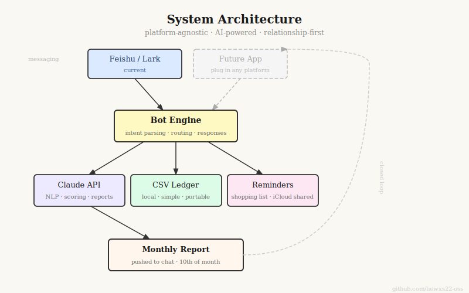
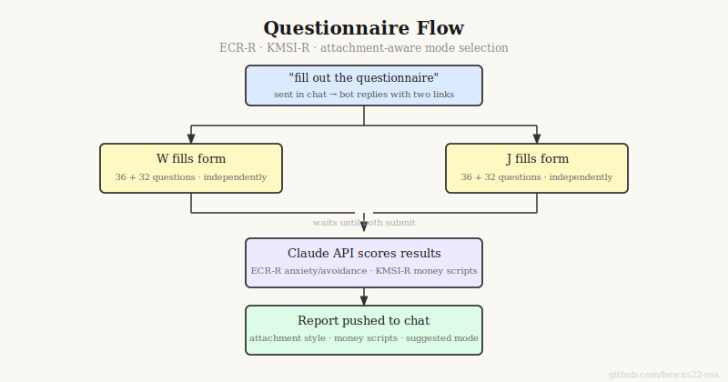
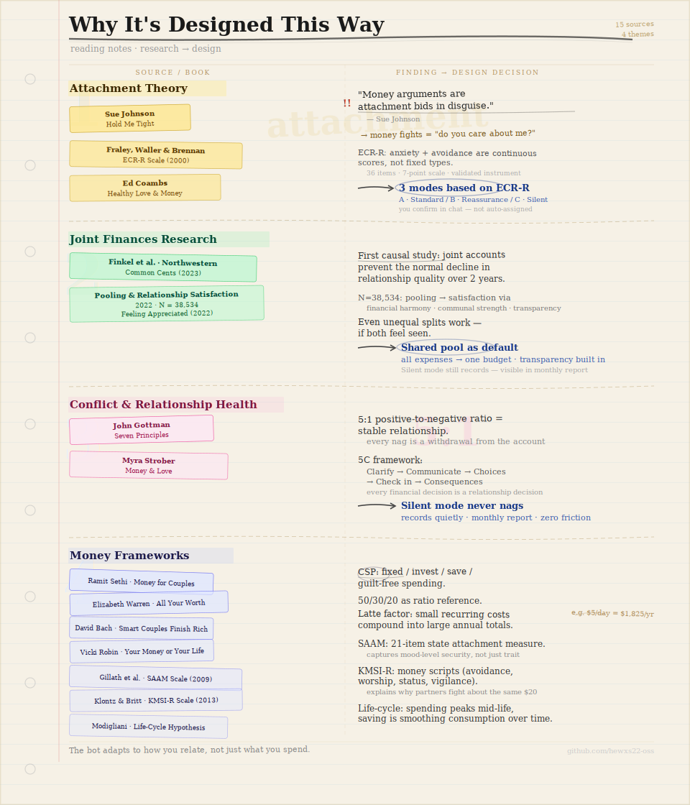

# Shared Expense Tracker

A Lark (Feishu) bot for couples to track shared expenses — designed around relationship research, not just accounting.

Most expense-splitting apps treat money as a math problem. This one treats it as a relationship problem. The bot adapts its behavior to each couple's attachment style, based on validated psychological scales.

> Bot messages and the questionnaire UI are currently in Chinese. The architecture and logic are fully documented in English here.

---

## What makes it different

**Standard expense trackers** record what you spent. This one also asks *how money makes you feel* — and adjusts accordingly.

After both partners complete a short questionnaire (ECR-R + KMSI-R), the bot switches into one of three modes:



| Mode | Best for | Behavior |
|------|----------|----------|
| **Standard** | Secure attachment | Brief confirmation on each expense |
| **Reassurance** | Anxious attachment | Confirmation + current balance + mid-month check-in |
| **Silent** | Avoidant attachment | Records everything, replies nothing, monthly report only |

The questionnaire measures two things:
- **ECR-R** (Experiences in Close Relationships – Revised): attachment anxiety and avoidance dimensions
- **KMSI-R** (Klontz Money Script Inventory – Revised): money avoidance, worship, status, and vigilance beliefs

Both are validated academic scales, not custom quizzes.



---

## Architecture



```
Feishu group message
        ↓
cc-connect (persistent WebSocket, auto-starts on boot)
        ↓
Claude Code (CLAUDE.md routing rules)
        ↓
scripts/ledger_handler.py
        ↓
Claude API (intent parsing: expense / query / shopping)
        ↓
data/ledger.csv  ←→  Apple Reminders (shopping items)
        ↓
Monthly report pushed back to Feishu group
```

The questionnaire form runs separately on Vercel (free tier), using Vercel KV to hold answers until both partners submit, then pushes the combined report to the Feishu group.

---

## Features



- **Natural language expense logging** — "grabbed coffee 28" gets parsed and categorized automatically
- **Proportional cost-splitting** — configurable ratio (e.g. 35/65) based on income difference
- **Category system** — shared pool, shared-but-not-pooled, personal; each with different accounting rules
- **Shopping intent detection** — "we're out of cat food" → writes a 🛒 reminder to Apple Reminders (shared via iCloud)
- **Monthly report** — auto-pushed on a configurable day; structured around Ramit Sethi's CSP framework and David Bach's latte factor
- **Attachment-adaptive modes** — bot behavior changes based on ECR-R questionnaire results
- **Vercel-hosted questionnaire** — publicly accessible form, no server required

---

## Setup

### Prerequisites

- macOS (Apple Reminders integration uses AppleScript)
- Python 3.12+ with [uv](https://github.com/astral-sh/uv)
- A [Lark](https://www.larksuite.com) account with a custom bot app (free tier works; Lark is the international version of Feishu)
- An [Anthropic API key](https://console.anthropic.com)
- A [Vercel](https://vercel.com) account (free tier is enough)

### 1. Clone and configure

```bash
git clone https://github.com/hewxs22-oss/shared-expense-tracker
cd shared-expense-tracker
cp config.example.json config.json
```

Edit `config.json`:
- `users`: display names for each partner (keys `W` and `J`)
- `open_id_mapping`: Feishu open_id → user key (find these in Feishu event payloads)
- `split_ratio`: cost-sharing proportions, must sum to 1.0
- `pool_amount`: monthly shared budget

### 2. Set up credentials

```bash
cp .env.example .env
```

Fill in `.env` with your Feishu App ID, App Secret, Chat ID, and Anthropic API key.

Alternatively, store secrets in macOS Keychain (see `scripts/keychain.py`).

### 3. Install dependencies

```bash
uv sync
```

### 4. Deploy the questionnaire to Vercel

A hosted version is available at https://shared-expense-tracker-mu.vercel.app — you can use it directly or deploy your own.

```bash
# Push to GitHub, then import the repo at vercel.com/new
# After deploy:
# 1. Create a KV database in Vercel Storage and connect it to the project
# 2. Add FEISHU_APP_ID, FEISHU_APP_SECRET, FEISHU_CHAT_ID as environment variables
# 3. Set form.vercel_url in config.json to your Vercel domain
```

### 5. Start the bot

```bash
uv run python scripts/bot.py
```

Or use [cc-connect](https://github.com/hewxs22-oss/cc-connect) for a persistent background process that auto-starts on login.

---

## Usage

In the Feishu group:

```
# Log an expense
bought cat food 80

# Query balance
how much is left this month

# Shopping reminder (writes to Apple Reminders)
we're out of laundry detergent

# Trigger the questionnaire
fill out the questionnaire

# Switch mode after completing the questionnaire
选A   (Standard)
选B   (Reassurance)
选C   (Silent)
```

---

## Research backing



The design draws on 15 sources across relationship psychology and personal finance:

| Source | Contribution |
|--------|-------------|
| Gottman, *The Seven Principles for Making Marriage Work* | 5:1 positive/negative ratio in conflict; emotional bank account |
| Sue Johnson, *Hold Me Tight* | Arguments about money are attachment bids: "do you still care about me?" |
| Fraley, Waller & Brennan (2000) | ECR-R scale — attachment anxiety and avoidance as continuous dimensions |
| Klontz & Britt (2013) | KMSI-R scale — four money script types |
| Ramit Sethi, *Money for Couples* | CSP framework: fixed costs / investments / savings / guilt-free spending |
| David Bach, *Smart Couples Finish Rich* | Latte factor: small recurring expenses compound into large annual totals |
| Myra Strober, *Money and Love* | 5C decision framework: Clarify → Communicate → Choices → Check in → Consequences |
| Pooling Finances and Relationship Satisfaction (2022, N=38,534) | Couples who pool finances report higher relationship satisfaction via three mechanisms: financial harmony, communal strength, transparency |
| Finkel et al., *Common Cents* (2023) | First causal study: joint accounts prevent the normal decline in relationship quality over the first two years of marriage |
| Elizabeth Warren, *All Your Worth* | 50/30/20 rule as the budget framework for the spending values conversation system |

Full citations and design rationale in [`设计总结.md`](设计总结.md) (Chinese) and [`design-summary.md`](design-summary.md) (English).

---

## Project structure

```
shared-expense-tracker/
├── api/index.py          # Vercel-adapted form server (Upstash KV storage)
├── scripts/
│   ├── bot.py            # Feishu WebSocket bot
│   ├── ledger_handler.py # Expense processing entry point (used by cc-connect)
│   ├── parser.py         # Claude API intent parsing
│   ├── ledger.py         # CSV read/write
│   ├── report.py         # Monthly report generation
│   ├── reminders.py      # Apple Reminders via AppleScript
│   ├── form_server.py    # Local questionnaire server (alternative to Vercel)
│   ├── system_mode.py    # Mode persistence (A/B/C)
│   └── keychain.py       # macOS Keychain secret management
├── templates/
│   ├── questionnaire.html  # ECR-R + KMSI-R form (68 questions)
│   └── submitted.html
├── categories.json       # Expense category definitions
├── config.example.json   # Configuration template
├── vercel.json           # Vercel routing config
└── 设计总结.md           # Full design document (Chinese)
```

---

## License

AGPL-3.0. You may use and modify this code, but any derivative work must also be open-sourced under AGPL. Commercial use by third parties is not permitted. The original author retains the right to commercially license this software separately.
